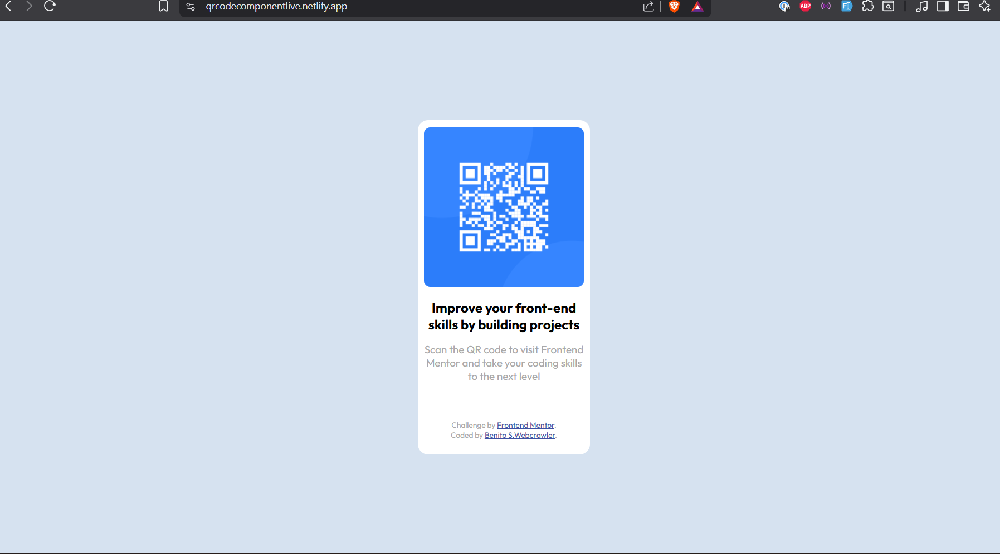

# QR code component

This is a solution to the [QR code component challenge on Frontend Mentor]

## Table of contents

- [Overview](#overview)
  - [Screenshot](#screenshot)
  - [Links](#links)
  - [Built with](#built-with)
  - [What I learned](#what-i-learned)
  - [Continued development](#continued-development)
  - [AI Collaboration](#ai-collaboration)

## Overview

This is a QR code component card Challenge.

### Screenshot



### Links

- Live Site URL: https://qrcodecomponentlive.netlify.app/

- Repository : https://github.com/ulquura/qr-code-component

- Frontend Mentor challenge : https://www.frontendmentor.io?ref=challenge

### Built with

- Semantic HTML5 markup
- CSS custom properties
- Flexbox
- Desktop-first workflow

### What I learned

I have better understanding of responsive design and media queries as well as flexbox and layout balance.
specifically i learn how to center a container

`````````````````````````````````````````````````````
CSS
body {  
  text-align: center;
  display: flex;
  align-items: center;
  justify-content: center;
}
`````````````````````````````````````````````````````
Also learned how important the main tag is for accessibility.

### Continued development

Need to do more complicated semantic html coding and box model css styling.

Have to do more responsive design. Don't understand why the smaller or equal sign don't make the breakpoint include the precise size given.

```````````````````````````````````````````````````````
@media(width <= 375px){

  .theQrcodeDescription {
    padding: 3vw;
  }
  .theQrcodeDescription > h1 {
    font-size: 17px;
  }
  .theQrcodeDescription > p {
    font-size: 12px;
  }
}

``````````````````````````````````````````````````````


### AI Collaboration

GitHub Copilot was very helpful validating my code and understand media queries structure. It gave step by step how-tos and suggested corrections with code snippets.

